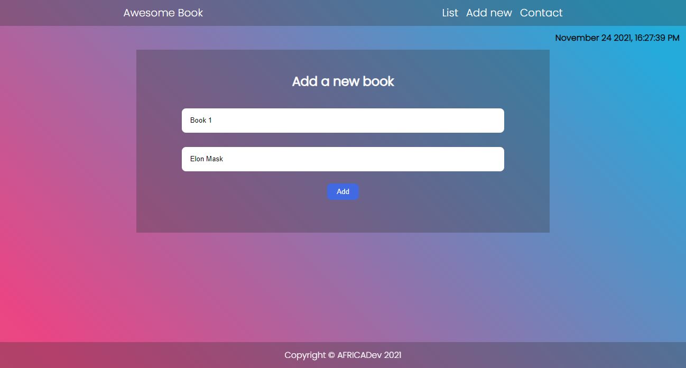

# Awesome-books
> This is awesome books project.

## Desktop version

## Awesome books Link

 [Live Demo Link](https://naskhalil.github.io/Awesome-books/)

## Built With
- HTML
- CSS
- JAVASCRIPT

## Getting Started

**Porject's features are added into seperate branch to keep main branch safe.**

To get a local copy up and running follow these simple example steps.

- create a new folder
- acccess the folder via command line
- run this under the command line: git clone https://github.com/NasKhalil/Awesome-books.git

### Prerequisites
-Html
-CSS
-JAVASCRIPT
-Git
-Github

### Setup
-None

### Install
-Git

### Usage
-None

### Run tests
-None

### Deployment
-None

👤 Authors
- GitHub: [@NasKhalil](https://github.com/NasKhalil)
- GitHub: [@zemola](https://github.com/zemola)

## 🤝 Contributing

Contributions, issues, and feature requests are welcome!

Feel free to check the [issues page](../../issues/).

## Show your support

Give a ⭐️ if you like this project!

## Acknowledgments

- Hat tip to anyone whose code was used
- Inspiration
- etc

## 📝 License

This project is [MIT](./MIT.md) licensed.